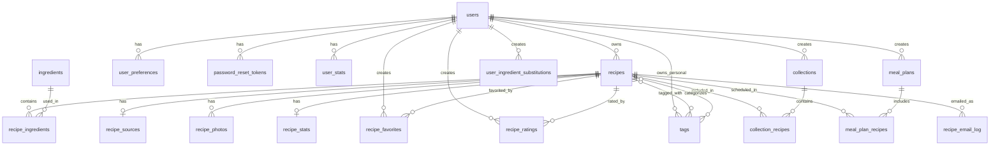

# Recipe Editor - Database Schema

## Overview

The Recipe Editor uses a MySQL database with 19 tables organized into 7 functional clusters.

**Total Entities**: 19 tables + 3 views + 8 triggers

---

## Interactive Entity Relationship Diagram



---

## Table Clusters

### 1. User Management (4 tables)

**Core Table: `users`**
- Stores user accounts, authentication, and profile data
- Fields: id, username, email, password_hash, display_name, is_admin, email_verified, etc.
- New fields: pending_email, email_change_token (for email updates)

**Related Tables**:
- `user_preferences` - User settings (1:1)
- `password_reset_tokens` - Password recovery tokens (1:N)
- `user_stats` - Cached user statistics (1:1)

### 2. Recipe Core (4 tables)

**Core Table: `recipes`**
- Main recipe content
- Fields: id, user_id, name, description, instructions, visibility, ingredients_json, etc.
- Visibility: private, public, incomplete

**Related Tables**:
- `recipe_sources` - Attribution info (1:1)
- `recipe_photos` - Recipe images (1:N)
- `recipe_stats` - Analytics & metrics (1:1)

### 3. Ingredient System (3 tables)

**Core Table: `ingredients`**
- Master ingredient catalog
- Fields: id, name, category, is_common, usage_count, nutritional_data, etc.
- Shared across all users

**Related Tables**:
- `recipe_ingredients` - Junction with measurements (N:M)
- `user_ingredient_substitutions` - Personal replacements (N:M)

### 4. Tag System (2 tables) ⭐ NEW

**Core Table: `tags`**
- Two types: system (admin-created) and personal (user-created)
- Fields: id, name, slug, **tag_scope**, **user_id**, tag_type, etc.
- System tags: user_id = NULL (visible to all)
- Personal tags: user_id set (visible only to owner)

**Related Tables**:
- `recipe_tags` - Junction table (N:M)

### 5. User Interactions (4 tables)

**Tables**:
- `recipe_favorites` - User saves recipes (N:M via users + recipes)
- `recipe_ratings` - User reviews (N:M via users + recipes)
- `collections` - User cookbooks (1:N from users)
- `collection_recipes` - Junction (N:M)

### 6. Meal Planning (2 tables)

**Tables**:
- `meal_plans` - Weekly/monthly plans (1:N from users)
- `meal_plan_recipes` - Scheduled recipes (N:M)

### 7. Tracking (1 table)

**Table**:
- `recipe_email_log` - Email sharing audit trail

---

## Visual Schema (ASCII)

```
┌──────────┐
│  USERS   │ (Core entity)
└────┬─────┘
     │
     ├─────► user_preferences (1:1)
     ├─────► password_reset_tokens (1:N)
     ├─────► user_stats (1:1)
     │
     ├─────► recipes (1:N) ───┬─────► recipe_sources (1:1)
     │                        ├─────► recipe_photos (1:N)
     │                        ├─────► recipe_stats (1:1)
     │                        ├─────► recipe_ingredients (N:M) ─────► ingredients
     │                        └─────► recipe_tags (N:M) ─────► tags
     │
     ├─────► recipe_favorites (N:M with recipes)
     ├─────► recipe_ratings (N:M with recipes)
     │
     ├─────► collections (1:N) ─────► collection_recipes (N:M with recipes)
     ├─────► meal_plans (1:N) ─────► meal_plan_recipes (N:M with recipes)
     │
     ├─────► user_ingredient_substitutions (N:M with ingredients)
     └─────► tags (1:N, personal tags only)
```

---

## Key Relationships Summary

| Relationship | Type | Description |
|--------------|------|-------------|
| users → recipes | 1:N | User owns many recipes |
| recipes → recipe_ingredients | 1:N | Recipe has many ingredients |
| recipes ↔ ingredients | N:M | Via recipe_ingredients junction |
| recipes ↔ tags | N:M | Via recipe_tags junction |
| users → tags | 1:N | User owns personal tags (system tags have NULL user_id) |
| recipes → recipe_sources | 1:1 | Recipe has one source |
| recipes → recipe_stats | 1:1 | Recipe has one stats record |
| users ↔ recipes | N:M | Via recipe_favorites (user favorites) |
| users ↔ recipes | N:M | Via recipe_ratings (user reviews) |
| collections ↔ recipes | N:M | Via collection_recipes |
| meal_plans ↔ recipes | N:M | Via meal_plan_recipes |

---

## Tag System Architecture (NEW Feature)

### Tag Types:

| tag_scope | user_id | Visibility | Example |
|-----------|---------|------------|---------|
| `system` | NULL | All users | VEGETARIAN, DESSERT, DINNER |
| `personal` | User ID | Only owner | MY_FAVORITES, FAMILY_RECIPE |

### Rules:
- Multiple users can create personal tags with identical names
- System tags are admin-created and permanent (cannot be deleted)
- Personal tags auto-delete when no longer used
- When recipe becomes public, personal tags move to notes field

### Example Data:

```
tags table:
┌────┬───────────┬──────────┬─────────┐
│ id │ name      │ tag_scope│ user_id │
├────┼───────────┼──────────┼─────────┤
│ 1  │ DINNER    │ system   │ NULL    │ ← All users see this
│ 2  │ LUNCH     │ personal │ 5       │ ← Only user 5 sees this
│ 3  │ LUNCH     │ personal │ 8       │ ← Only user 8 sees this (same name OK)
│ 4  │ BREAKFAST │ personal │ 5       │ ← Only user 5 sees this
└────┴───────────┴──────────┴─────────┘
```

---

## Email Update System (NEW Feature)

### New Fields in `users`:
- `pending_email` - New email awaiting verification
- `email_change_token` - Verification token
- `email_change_expires` - Token expiration (24 hours)

### Flow:
1. User requests email change (requires password)
2. Verification sent to new email
3. Notification sent to old email
4. User clicks verification link
5. Email updated, pending fields cleared

---

## Table Details

### users
**Purpose**: Core user accounts and authentication

**Key Fields**:
- `id` (PK) - Auto-increment
- `username` (UK) - Unique login name
- `email` (UK) - Unique email address
- `password_hash` - Encrypted password
- `display_name` - Public display name
- `is_admin` - Admin flag
- `email_verified` - Email verification status
- `can_publish_public` - Permission flag
- `pending_email` - New email awaiting verification ⭐ NEW
- `email_change_token` - Verification token ⭐ NEW

**Relationships**:
- Owns: recipes, collections, meal_plans, personal tags
- Has: preferences, stats, favorites, ratings

---

### recipes
**Purpose**: Main recipe content

**Key Fields**:
- `id` (PK) - Auto-increment
- `user_id` (FK) - Owner
- `name` - Recipe title
- `description` - Brief summary
- `instructions` - Cooking steps
- `notes` - Additional info
- `visibility` - private/public/incomplete
- `slug` (UK) - URL-friendly identifier
- `ingredients_json` - JSON array of ingredients

**Relationships**:
- Owned by: users
- Has: ingredients, tags, source, photos, stats
- Featured in: collections, meal plans, favorites, ratings

---

### ingredients
**Purpose**: Master ingredient catalog (shared)

**Key Fields**:
- `id` (PK) - Auto-increment
- `name` (UK) - Unique ingredient name
- `category` - Categorization
- `is_common` - Frequently used flag
- `usage_count` - Recipe count (auto-updated)
- `nutritional_data` - JSON nutrition info
- `allergen_info` - JSON allergen data

**Relationships**:
- Used in: recipes (via recipe_ingredients)
- Substituted in: user_ingredient_substitutions

---

### tags ⭐ UPDATED
**Purpose**: Recipe categorization (system + personal)

**Key Fields**:
- `id` (PK) - Auto-increment
- `name` - Tag name (uppercase)
- `slug` - URL-friendly
- `tag_scope` (ENUM) - 'system' or 'personal' ⭐ NEW
- `user_id` (FK, nullable) - Owner for personal tags ⭐ NEW
- `tag_type` - cuisine/diet/meal_type/etc.

**Relationships**:
- Categorizes: recipes (via recipe_tags)
- Owned by: users (personal tags only)

**Unique Constraints**:
- System tags: globally unique by name
- Personal tags: unique per (user_id, name)

---

## Cascade Delete Behavior

When a record is deleted, what happens to related records:

| Parent Delete | Child Table | Action |
|---------------|-------------|--------|
| User deleted | All user's recipes | CASCADE (deleted) |
| User deleted | User's personal tags | CASCADE (deleted) |
| User deleted | User's favorites | CASCADE (deleted) |
| User deleted | User preferences | CASCADE (deleted) |
| Recipe deleted | Recipe ingredients | CASCADE (deleted) |
| Recipe deleted | Recipe tags | CASCADE (deleted) |
| Recipe deleted | Recipe favorites | CASCADE (deleted) |
| Recipe deleted | Recipe photos | CASCADE (deleted) |
| Ingredient deleted | Recipe ingredients | RESTRICT (blocked if used) |
| Tag deleted | Recipe tags | CASCADE (deleted) |

---

## Indexes for Performance

### FULLTEXT Search Indexes:
- `recipes`: (name, description, instructions, notes)
- `ingredients`: (name, plural_name)

### Composite Indexes:
- `recipes`: (user_id, created_at DESC)
- `recipe_ratings`: (recipe_id, rating DESC)
- `recipe_stats`: (favorite_count DESC, average_rating DESC)
- `tags`: (user_id, name) ⭐ NEW

### Foreign Key Indexes:
- Auto-created on all foreign key columns

---

## Database Triggers (8 total)

### Recipe Statistics:
- `after_favorite_insert` - Increment favorite_count
- `after_favorite_delete` - Decrement favorite_count
- `after_rating_insert` - Update rating stats
- `after_rating_update` - Recalculate averages
- `after_rating_delete` - Update rating stats

### User Statistics:
- `after_recipe_insert` - Increment user recipe_count
- `after_recipe_delete` - Decrement user recipe_count

### Ingredient Tracking:
- `after_recipe_ingredient_insert` - Increment usage_count
- `after_recipe_ingredient_delete` - Decrement usage_count

---

## JSON Fields

### recipes.ingredients_json
Stores complete ingredient list with measurements:
```json
[
  {
    "description": "all-purpose flour",
    "amount": "2",
    "unit": "cups",
    "notes": ""
  },
  {
    "description": "sugar",
    "amount": "1",
    "unit": "cup",
    "notes": ""
  }
]
```

### user_preferences.dietary_restrictions
```json
["vegetarian", "nut-free", "dairy-free"]
```

### ingredients.aliases
```json
["cilantro", "coriander leaves", "chinese parsley"]
```

---

## Storage Estimates

**For 1,000 recipes and 100 users**:

| Table | Size | Notes |
|-------|------|-------|
| recipes | 5-10 MB | Text content |
| recipe_ingredients | 2-5 MB | Ingredient relationships |
| ingredients | 1-2 MB | Master catalog |
| tags | <1 MB | Tag catalog |
| users | <1 MB | User accounts |
| photos | <1 MB | URLs only (not images) |
| Other tables | 3-5 MB | Stats, logs, junction tables |
| **Total** | **15-25 MB** | Database only |

*Note: Recipe photos stored in filesystem, not database*

---

## Database Views

### recipe_detail_view
Complete recipe with owner info, source, tags, and stats in one query.

### user_favorites_view  
User's favorited recipes with full details.

### popular_ingredients_view
Ingredients ranked by usage across all recipes.

---

## Complete Table List

### Core Tables (3)
1. `users` - User accounts
2. `recipes` - Recipe content
3. `ingredients` - Ingredient catalog

### User Management (3)
4. `user_preferences` - User settings
5. `password_reset_tokens` - Password recovery
6. `user_stats` - User statistics

### Recipe Details (3)
7. `recipe_sources` - Source attribution
8. `recipe_photos` - Recipe images
9. `recipe_stats` - Recipe analytics

### Ingredient System (2)
10. `recipe_ingredients` - Recipe-ingredient junction
11. `user_ingredient_substitutions` - Personal substitutions

### Tag System (2)
12. `tags` - Tag catalog (system + personal)
13. `recipe_tags` - Recipe-tag junction

### User Interactions (4)
14. `recipe_favorites` - User favorites
15. `recipe_ratings` - User reviews
16. `collections` - User cookbooks
17. `collection_recipes` - Collection-recipe junction

### Meal Planning (2)
18. `meal_plans` - Meal schedules
19. `meal_plan_recipes` - Plan-recipe junction

### Tracking (1)
20. `recipe_email_log` - Email audit trail

---

## Detailed Table Schemas

### users

| Column | Type | Constraints | Description |
|--------|------|-------------|-------------|
| id | INT | PK, AUTO_INCREMENT | Unique user ID |
| username | VARCHAR(50) | UNIQUE, NOT NULL | Login username |
| email | VARCHAR(255) | UNIQUE, NOT NULL | Email address |
| password_hash | VARCHAR(255) | NOT NULL | Encrypted password |
| display_name | VARCHAR(100) | NULL | Public display name |
| avatar_url | VARCHAR(500) | NULL | Profile picture URL |
| email_verified | BOOLEAN | DEFAULT FALSE | Email confirmed? |
| is_active | BOOLEAN | DEFAULT TRUE | Account active? |
| is_admin | BOOLEAN | DEFAULT FALSE | Admin privileges? |
| can_publish_public | BOOLEAN | DEFAULT FALSE | Can publish public recipes? |
| pending_email | VARCHAR(255) | NULL | New email awaiting verification |
| email_change_token | VARCHAR(100) | NULL | Email change verification token |
| email_change_expires | TIMESTAMP | NULL | Token expiration |
| created_at | TIMESTAMP | DEFAULT CURRENT_TIMESTAMP | Account creation |
| updated_at | TIMESTAMP | AUTO UPDATE | Last modification |
| last_login | TIMESTAMP | NULL | Last login time |

---

### recipes

| Column | Type | Constraints | Description |
|--------|------|-------------|-------------|
| id | INT | PK, AUTO_INCREMENT | Unique recipe ID |
| user_id | INT | FK → users.id, NOT NULL | Recipe owner |
| name | VARCHAR(200) | NOT NULL | Recipe title |
| description | TEXT | NULL | Brief summary |
| instructions | TEXT | NOT NULL | Cooking steps |
| notes | TEXT | NULL | Additional notes |
| prep_time | INT | NULL | Prep time (minutes) |
| cook_time | INT | NULL | Cook time (minutes) |
| total_time | INT | GENERATED | Sum of prep + cook |
| servings | VARCHAR(50) | NULL | Serving size |
| difficulty | ENUM | easy/medium/hard | Difficulty level |
| visibility | ENUM | private/public/incomplete | Who can see it |
| slug | VARCHAR(250) | UNIQUE | URL-friendly name |
| meta_description | VARCHAR(300) | NULL | SEO description |
| ingredients_json | JSON | NULL | Ingredient array |
| created_at | TIMESTAMP | DEFAULT CURRENT_TIMESTAMP | Creation time |
| updated_at | TIMESTAMP | AUTO UPDATE | Last edit |
| published_at | TIMESTAMP | NULL | Publication time |

---

### tags (Updated Schema)

| Column | Type | Constraints | Description |
|--------|------|-------------|-------------|
| id | INT | PK, AUTO_INCREMENT | Unique tag ID |
| name | VARCHAR(100) | NOT NULL | Tag name (uppercase) |
| slug | VARCHAR(100) | NOT NULL | URL-friendly |
| tag_scope | ENUM | 'system' or 'personal' | Tag type ⭐ |
| user_id | INT | FK → users.id, NULL | Owner (personal tags) ⭐ |
| description | TEXT | NULL | Tag description |
| tag_type | ENUM | cuisine/diet/meal_type/etc | Category |
| icon | VARCHAR(100) | NULL | Icon identifier |
| created_at | TIMESTAMP | DEFAULT CURRENT_TIMESTAMP | Creation time |

**Indexes**:
- `idx_user_name` (user_id, name) - Fast lookups ⭐
- `idx_tag_scope` (tag_scope) - Filter by type ⭐

---

### ingredients

| Column | Type | Constraints | Description |
|--------|------|-------------|-------------|
| id | INT | PK, AUTO_INCREMENT | Unique ingredient ID |
| name | VARCHAR(200) | UNIQUE, NOT NULL | Ingredient name |
| plural_name | VARCHAR(200) | NULL | Plural form |
| category | VARCHAR(50) | NULL | dairy/meat/vegetable/etc |
| subcategory | VARCHAR(50) | NULL | More specific category |
| aliases | JSON | NULL | Alternative names |
| is_common | BOOLEAN | DEFAULT FALSE | Frequently used? |
| allergen_info | JSON | NULL | Allergen data |
| nutritional_data | JSON | NULL | Nutrition facts |
| default_unit | VARCHAR(20) | NULL | Common unit |
| usage_count | INT | DEFAULT 0 | # recipes using |
| created_at | TIMESTAMP | DEFAULT CURRENT_TIMESTAMP | Added when |
| updated_at | TIMESTAMP | AUTO UPDATE | Last modified |

---

## Migration Files

To set up or update the database:

| File | Purpose | When to Run |
|------|---------|-------------|
| `schema/mysql_schema.sql` | Initial schema creation | New installation only |
| `migrate_add_tag_scope.py` | Add tag_scope and user_id | For tag system update |
| `migrate_tags_to_personal.py` | Convert existing tags | After tag_scope migration |
| `migrate_add_email_change.py` | Add email change fields | For email update feature |
| `migrate_remove_bio.py` | Remove bio column | Cleanup unused field |

---

## Data Integrity Rules

### Unique Constraints:
- `users.username` - No duplicate usernames
- `users.email` - No duplicate emails (except pending_email)
- `recipes.slug` - Unique URL slugs
- `ingredients.name` - Unique ingredient names
- System tags: name is globally unique
- Personal tags: (user_id, name) is unique per user

### Check Constraints:
- `recipe_ratings.rating` - Between 0.0 and 5.0
- `recipes.total_time` - Auto-calculated (prep + cook)

### NULL Rules:
- System tags: `user_id` must be NULL
- Personal tags: `user_id` must NOT be NULL
- Required fields cannot be NULL (enforced by NOT NULL)

---

## Query Examples

### Get all tags for a user (system + personal):
```sql
SELECT * FROM tags 
WHERE tag_scope = 'system' 
   OR (tag_scope = 'personal' AND user_id = ?)
ORDER BY name;
```

### Get recipes with all details:
```sql
SELECT * FROM recipe_detail_view 
WHERE visibility = 'public' 
ORDER BY created_at DESC;
```

### Find popular ingredients:
```sql
SELECT * FROM popular_ingredients_view 
LIMIT 20;
```

### Convert personal tag to system:
```sql
-- Find all personal tags with name "DINNER"
-- Create system tag
-- Update recipe_tags to point to system tag
-- Delete personal tags
```

---

## Backup and Recovery

### Full Backup:
```bash
mysqldump -u user -p recipe_editor_prod > backup.sql
```

### Table-Specific Backup:
```bash
mysqldump -u user -p recipe_editor_prod users recipes > essential_backup.sql
```

### Restore:
```bash
mysql -u user -p recipe_editor_prod < backup.sql
```

---

## Performance Considerations

### Optimizations Implemented:
- FULLTEXT indexes for search queries
- Composite indexes for common JOIN patterns
- Cached counts in stats tables (updated via triggers)
- JSON for flexible schema (ingredients, preferences)
- CASCADE deletes for automatic cleanup

### Monitoring Queries:
```sql
-- Find slow queries
SHOW PROCESSLIST;

-- Check table sizes
SELECT table_name, 
       ROUND((data_length + index_length) / 1024 / 1024, 2) AS 'Size (MB)'
FROM information_schema.TABLES 
WHERE table_schema = 'recipe_editor_prod'
ORDER BY (data_length + index_length) DESC;

-- Check index usage
SHOW INDEX FROM recipes;
```

---

## Future Schema Enhancements

Potential additions:
1. `shopping_lists` - Auto-generate from meal plans
2. `recipe_versions` - Track recipe edit history
3. `tag_categories` - Hierarchical tag organization
4. `user_notifications` - In-app notification system
5. `recipe_comments` - User discussion threads
6. `cooking_sessions` - Track when recipes are made

---

**Schema Version**: 2.0 (with tag system and email updates)  
**Last Updated**: November 2025  
**Maintainer**: Recipe Editor Team
